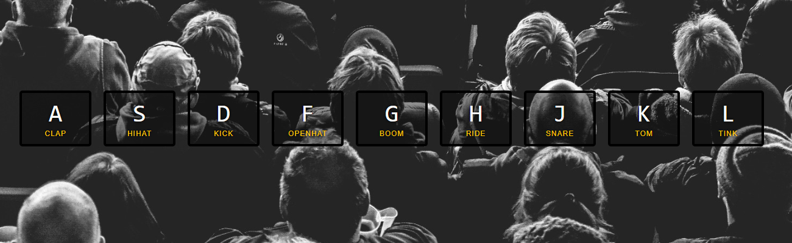

# Drum Kit

### Specification
- (이벤트) -> (결과)
- 키보드로 눌렀을 때, 해당 소리와 모양의 변화가 일어나게 한다.

### Solving process 
1. key와 audio 노드를 잡아준다.
2. keydown 이벤트가 일어났을때, key에 'playing' 클래스 명과 오디오를 재생 시킨다.
3. 이미 playing된 키가 있다면 삭제하고, 현재의 클릭된 키만 활성화

### What I learned
- 기본적인 js의 selection; e.g [querySelector](https://developer.mozilla.org/en-US/docs/Web/API/Document/querySelector)
- [\<audio\>](https://developer.mozilla.org/ko/docs/Web/API/Web_Audio_API)
- [Array.from()](https://developer.mozilla.org/ko/docs/Web/JavaScript/Reference/Global_Objects/Array/from)
- ['transitionend' event](https://developer.mozilla.org/en-US/docs/Web/API/HTMLElement/transitionend_event)
- [classList](https://developer.mozilla.org/en-US/docs/Web/API/Element/classList) 는 복수노드를 처리하지 않는다. 

### See also
- [Simple synth keyboard](https://developer.mozilla.org/en-US/docs/Web/API/Web_Audio_API/Simple_synth)
